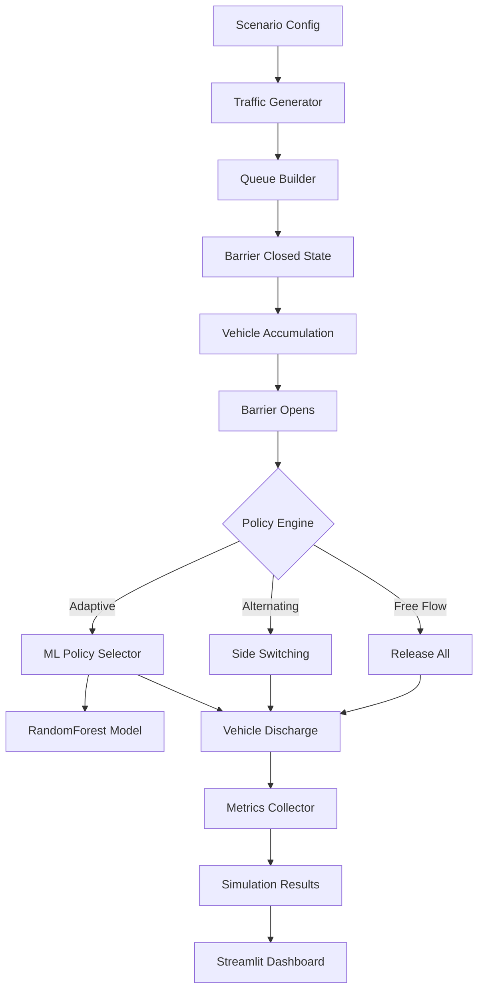
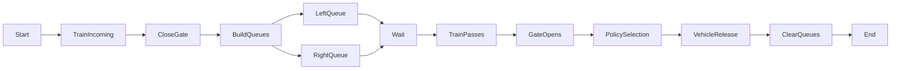
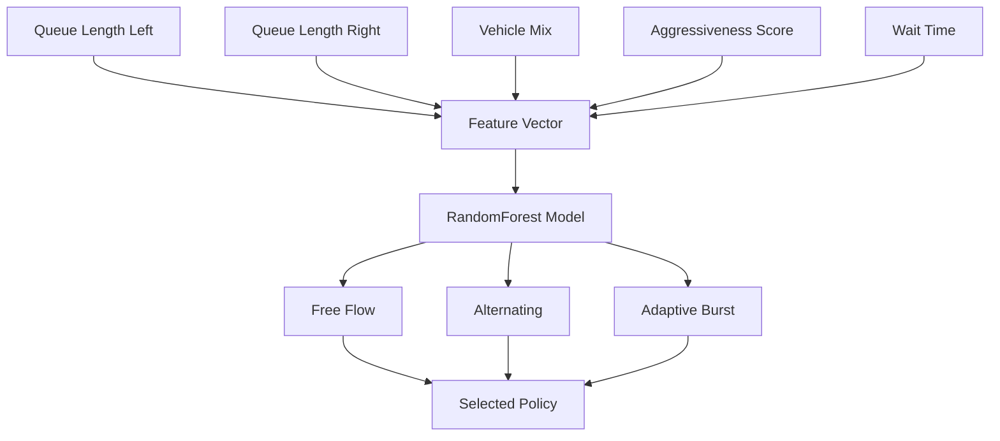
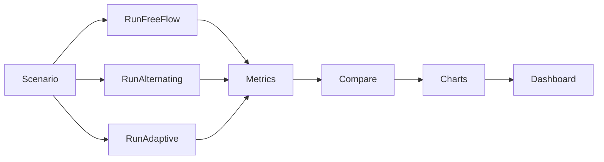

# 🚦 QuarryFlow-Crossing

**Adaptive Traffic Release Strategies for Railway Level Crossings**
A simulation and ML-driven framework to model vehicle queues at railway crossings and evaluate intelligent gate release policies.

**PPT Link: https://docs.google.com/presentation/d/1bjiNACeunBeg3E3gGEhl7RxeQ6ssqoSKdKAGcxi-njU/edit?usp=sharing**

# ✨ Overview

QuarryFlow-Crossing simulates **two-sided traffic queues** at railway level crossings and evaluates multiple **vehicle release strategies**, including:

* Free Flow Release
* Alternating Release
* Adaptive Burst Release
* ML-based Policy Selection (RandomForest)

The system models:

* Mixed vehicle types
* Queue accumulation
* Aggressive drivers
* Waiting time penalties
* Crossing clearance efficiency


# 🧠 System Architecture

This diagram shows the **end-to-end pipeline** of the QuarryFlow simulation.  
Traffic is generated, queues accumulate while the barrier is closed, and once the gate opens, a **policy engine** selects the optimal vehicle release strategy. Metrics are collected and visualized in the dashboard.





## 🚦 Railway Crossing Simulation Flow

This diagram illustrates the real-world crossing behaviour.
When a train approaches, the gate closes and vehicles accumulate on both sides.
After the train passes, a release policy determines how queues are cleared.




## 🤖 Adaptive ML Policy Selection

The adaptive system converts traffic conditions into a feature vector and uses a RandomForest model to dynamically choose the best release policy.

The model considers:

- Queue imbalance
- Vehicle composition
- Driver aggressiveness
- Waiting time
- Traffic pressure




## 📊 Policy Comparison Pipeline

This pipeline evaluates multiple release strategies under identical scenarios and compares their performance metrics.

The framework runs:

- Free Flow policy
- Alternating policy
- Adaptive ML policy

Then compares them using wait time, fairness, throughput, and clearance speed.


## 📁 Project Structure

```
QuarryFlow-Crossing
│
├── src/
│   ├── simulation/
│   ├── policies/
│   ├── models/
│   └── metrics/
│
├── scripts/
│   ├── train_model.py
│   ├── compare_policies.py
│   └── generate_data.py
│
├── app/
│   └── streamlit_app.py
│
├── tests/
│
└── README.md
```

## ⚙️ Installation

```bash
git clone https://github.com/Codiosityy/QuarryFlow-Crossing
cd QuarryFlow-Crossing
pip install -r requirements.txt
```

## ▶️ Run Simulation

```bash
python scripts/compare_policies.py
```

## 🤖 Train ML Policy Model

```bash
python scripts/train_model.py
```

## 📊 Launch Dashboard

```bash
streamlit run app/streamlit_app.py
```

## 📈 Metrics Evaluated

* Average wait time
* Queue length
* Clearance time
* Throughput
* Fairness index
* Starvation probability


## 🧪 Policies Implemented

| Policy         | Description                       |
| -------------- | --------------------------------- |
| Free Flow      | All vehicles released immediately |
| Alternating    | Left-right switching              |
| Adaptive Burst | Larger queue priority             |

## 🎯 Use Cases

* Railway crossing optimization
* Traffic signal research
* Smart city simulation
* Reinforcement learning experiments
* Transport policy evaluation


## 🧠 Future Work

* Reinforcement learning policy
* Multi-crossing simulation
* Real-world dataset integration
* Live traffic API support
* GPU simulation engine


### 📜 License

MIT License

---

## 👨‍💻 Author

**Codiosityy**
**thekeshavladdha**

### ⭐ Star the repo if you find it useful
