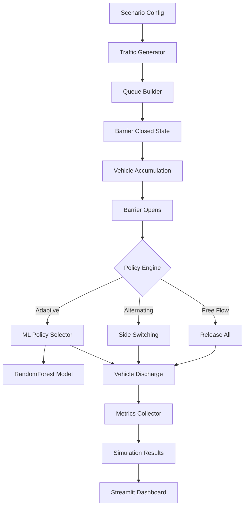
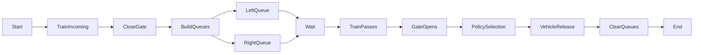
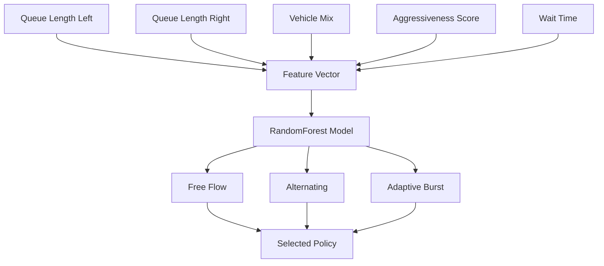
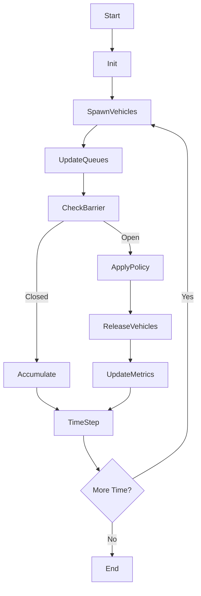
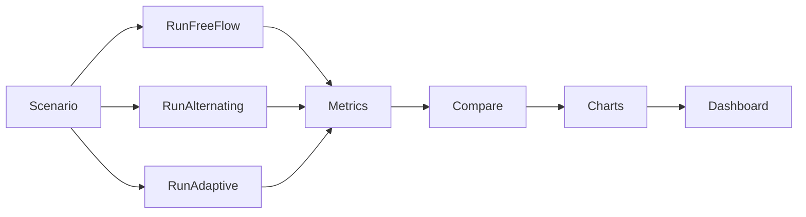
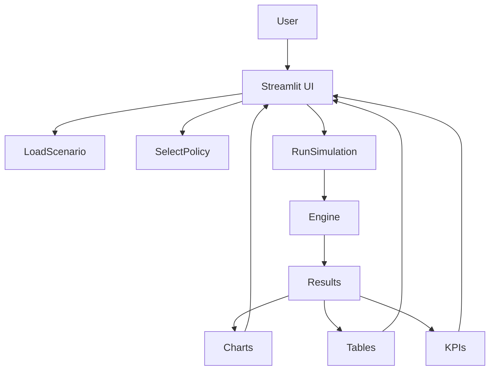
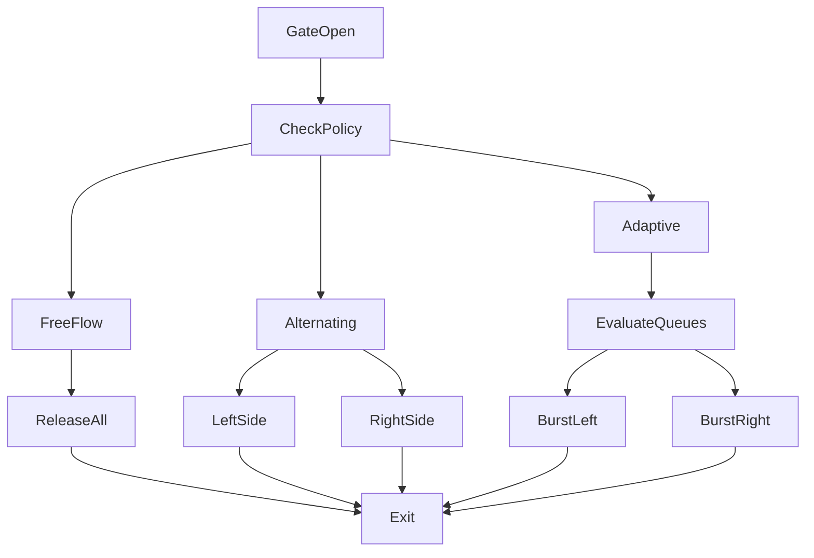

# 🚦 QuarryFlow-Crossing

**Adaptive Traffic Release Strategies for Railway Level Crossings**
A simulation and ML-driven framework to model vehicle queues at railway crossings and evaluate intelligent gate release policies.

---

# ✨ Overview

QuarryFlow-Crossing simulates **two-sided traffic queues** at railway level crossings and evaluates multiple **vehicle release strategies**, including:

* Free Flow Release
* Alternating Release
* Adaptive Burst Release
* ML-based Policy Selection (RandomForest)

The system models:

* Mixed vehicle types
* Queue accumulation
* Aggressive drivers
* Waiting time penalties
* Crossing clearance efficiency

---

# 🧠 System Architecture



---

# 🚦 Railway Crossing Simulation Flow



---

# 🤖 Adaptive ML Policy Selection



---

# 🔁 Core Simulation Loop



---

# 📊 Policy Comparison Pipeline



---

# 🎛️ Streamlit Dashboard Architecture



---

# 🧩 Vehicle Release Strategy Logic



---

# 📁 Project Structure

```
QuarryFlow-Crossing
│
├── src/
│   ├── simulation/
│   ├── policies/
│   ├── models/
│   └── metrics/
│
├── scripts/
│   ├── train_model.py
│   ├── compare_policies.py
│   └── generate_data.py
│
├── app/
│   └── streamlit_app.py
│
├── tests/
│
└── README.md
```

---

# ⚙️ Installation

```bash
git clone https://github.com/Codiosityy/QuarryFlow-Crossing
cd QuarryFlow-Crossing
pip install -r requirements.txt
```

---

# ▶️ Run Simulation

```bash
python scripts/compare_policies.py
```

---

# 🤖 Train ML Policy Model

```bash
python scripts/train_model.py
```

---

# 📊 Launch Dashboard

```bash
streamlit run app/streamlit_app.py
```

---

# 📈 Metrics Evaluated

* Average wait time
* Queue length
* Clearance time
* Throughput
* Fairness index
* Starvation probability

---

# 🧪 Policies Implemented

| Policy         | Description                       |
| -------------- | --------------------------------- |
| Free Flow      | All vehicles released immediately |
| Alternating    | Left-right switching              |
| Adaptive Burst | Larger queue priority             |
| ML Adaptive    | RandomForest decision             |

---

# 🎯 Use Cases

* Railway crossing optimization
* Traffic signal research
* Smart city simulation
* Reinforcement learning experiments
* Transport policy evaluation

---

# 🧠 Future Work

* Reinforcement learning policy
* Multi-crossing simulation
* Real-world dataset integration
* Live traffic API support
* GPU simulation engine

---

# 📜 License

MIT License

---

# 👨‍💻 Author

**Codiosityy**

---

# ⭐ Star the repo if you find it useful
